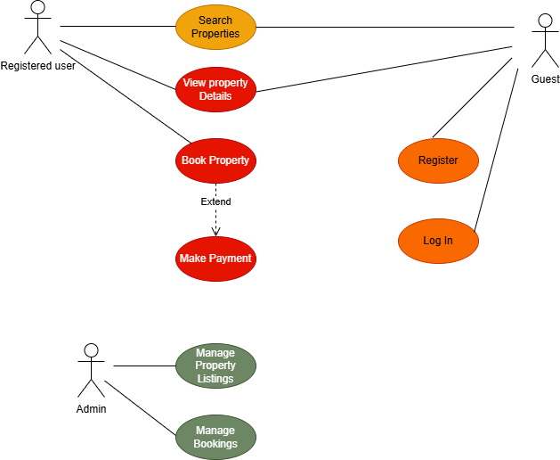

# Requirement Analysis in Software Development.
This repository is dedicated to exploring the process of requirement analysis in software development. It serves as a resource for understanding how to gather, document, and manage software requirements effectively.

## What is Requirement Analysis?
Requirement Analysis is the process of identifying, documenting, and managing the needs and expectations of stakeholders for a software system. It is a crucial phase in the Software Development Life Cycle (SDLC) that ensures the final product aligns with business objectives and user needs.

During this phase, software engineers work closely with stakeholders—including clients, users, and business analysts—to gather detailed information about the system's intended functions, performance criteria, and constraints. The process involves techniques such as interviews, surveys, document analysis, and use case modeling.

Importance in the SDLC:
Clarifies Project Scope: Helps define the boundaries and goals of the project to avoid scope creep.

Reduces Development Errors: Clear and accurate requirements minimize the risk of misunderstandings and rework during development.

Improves Communication: Acts as a communication bridge between stakeholders and the development team.

Enhances Planning and Estimation: Well-defined requirements support better project planning, resource allocation, and time estimation.

Increases Customer Satisfaction: Meeting documented requirements increases the likelihood of delivering a product that meets or exceeds user expectations.

In essence, requirement analysis lays the foundation for a successful software project by ensuring that everyone involved shares a common understanding of what needs to be built and why.

## Why is Requirement Analysis Important?
Requirement Analysis is a foundational step in the Software Development Life Cycle (SDLC), and its significance cannot be overstated. Here are three key reasons why it is critical:

- Prevents Miscommunication and Misunderstanding:
By clearly documenting user needs and system expectations, requirement analysis ensures that all stakeholders—developers, clients, and end-users—are on the same page. This reduces the chances of confusion, misaligned expectations, and project delays.

- Reduces Development Costs and Rework:
Identifying and addressing potential issues early in the development cycle is much more cost-effective than fixing problems later. A thorough analysis helps detect missing or conflicting requirements before any code is written, minimizing costly rework.

- Improves Product Quality and User Satisfaction:
When a system is built according to well-defined and validated requirements, it is more likely to function as intended and meet user needs. This results in a higher-quality product, better user experience, and increased customer satisfaction.

## Key Activities in Requirement Analysis
Requirement Analysis involves several structured activities to ensure a complete and accurate understanding of what the software system must achieve. The five key activities are:

- Requirement Gathering
This is the initial step where information is collected from various stakeholders such as clients, users, and subject matter experts. It focuses on understanding the broad needs and high-level goals of the system.

- Requirement Elicitation
In this stage, deeper insights are drawn using techniques like interviews, questionnaires, workshops, observation, and brainstorming. The goal is to uncover hidden needs, expectations, and constraints.

- Requirement Documentation
All collected requirements are organized and recorded in a clear and structured format. Common documentation includes Software Requirement Specifications (SRS), user stories, or use cases, making it easier for teams to reference and implement.

- Requirement Analysis and Modeling
This activity involves examining the requirements to ensure they are complete, consistent, feasible, and unambiguous. Models such as data flow diagrams, entity-relationship diagrams, or use case diagrams may be created to visualize the system.

-Requirement Validation
This final step ensures that the documented requirements accurately reflect stakeholder needs. Validation techniques include walkthroughs, reviews, and prototyping to confirm that the right system is being built before development begins.

## Types of Requirements
In software development, requirements are typically categorized into two main types: Functional Requirements and Non-functional Requirements. Below are definitions and examples of each, contextualized for a hotel booking management system similar to platforms like Airbnb or OYO.

### Functional Requirements
Functional requirements define the specific behaviors, functions, and operations of a system. They describe what the system should do.

Examples for a Hotel Booking Management System:

- User Registration and Authentication:
Users should be able to create accounts, log in, and manage their profiles securely.

- Hotel Search Functionality:
Users can search for hotels based on criteria such as location, check-in/check-out dates, number of guests, and amenities.

- Room Booking:
Users can select available rooms, view pricing, and make reservations for specific dates.

- Payment Processing:
The system should handle payments through various methods, including credit/debit cards and digital wallets.

- Booking Management:
Users can view, modify, or cancel their bookings, and receive confirmation notifications.

- Host Management Portal:
Hotel owners or hosts can list their properties, manage room availability, set pricing, and view booking statistics.

### Non-functional Requirements
Non-functional requirements specify the quality attributes of a system, such as performance, security, usability, and scalability. They define how the system performs its functions.

Examples for a Hotel Booking Management System:

- Performance:
The system should handle a high number of concurrent users, especially during peak booking periods, without significant degradation in response time.

- Scalability:
The architecture should support scaling to accommodate growth in user base and data volume, ensuring consistent performance.

- Availability:
The system should be highly available, aiming for minimal downtime to ensure users can access services at any time.

- Security:
User data, including personal and payment information, must be protected through encryption and secure authentication mechanisms.

- Usability:
The user interface should be intuitive and user-friendly, facilitating easy navigation and interaction for users of varying technical proficiency.

- Maintainability:
The system should be designed in a modular fashion to allow for easy updates, bug fixes, and integration of new features.

## Use Case Diagrams.
### What are Use Case Diagrams?
 - Use case diagrams show how different users (actors) interact with the system to achieve specific goals (use cases).
### Benefits of Use Case Diagrams:
 - Provide a clear visual representation of system functionalities.
 - Help in identifying and organizing system requirements.
 - Facilitate communication among stakeholders and development team.

## Acceptance Criteria.
### What is Acceptance Criteria?
 - Acceptance criteria are conditions that a feature must meet to be accepted by the stakeholders.
### Benefits of Acceptance Criteria:
 - Ensure all parties have a clear understanding of feature requirements.
 - Provide a basis for testing and validation.
 - Help in maintaining quality and meeting user expectations.Acceptance Criteria for Checkout Feature
### Acceptance Criteria for Checkout Feature
Scenario: Successful Payment Processing
Given the user has selected a room and proceeded to checkout, When they enter valid payment details and confirm the booking, Then the system should process the payment and generate a booking confirmation.

Scenario: Invalid Payment Details
Given the user has entered incorrect or incomplete payment details, When they attempt to submit the payment, Then the system should display an error message and prompt the user to enter correct details.

